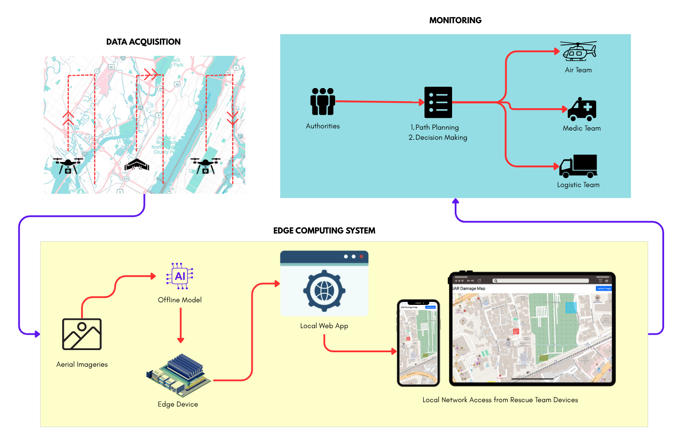
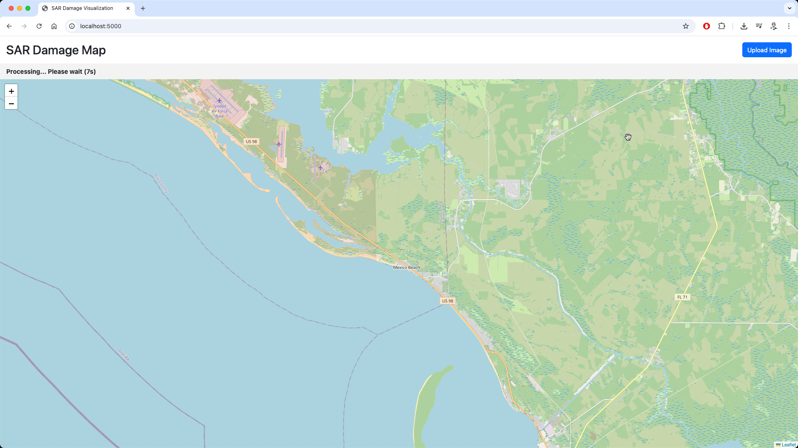
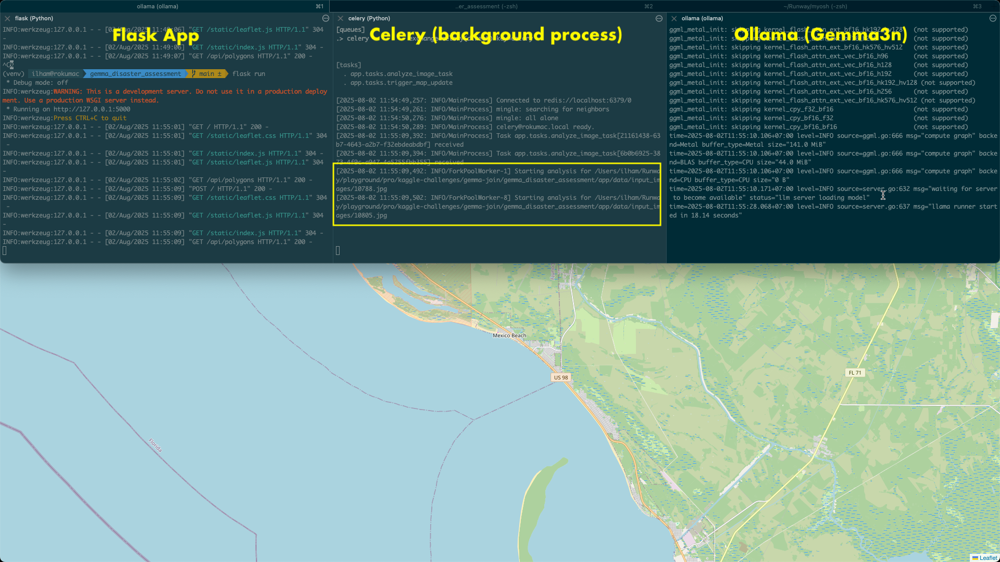
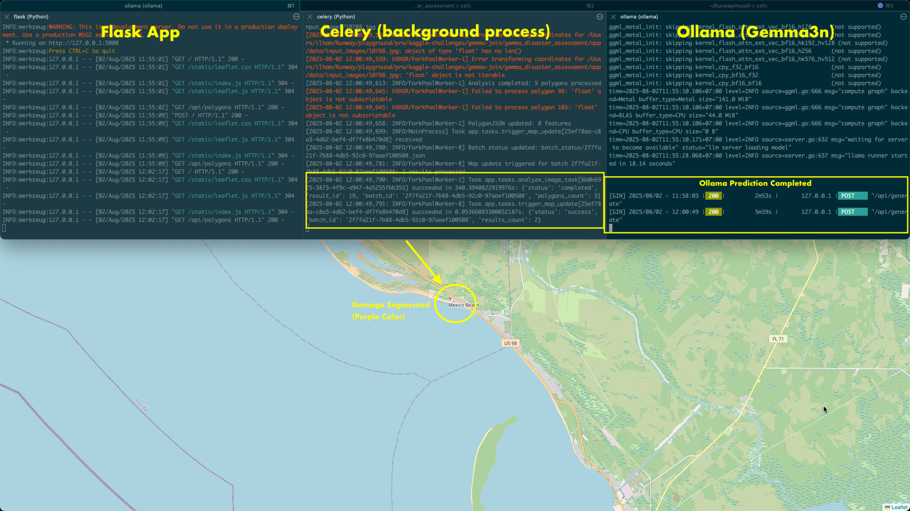
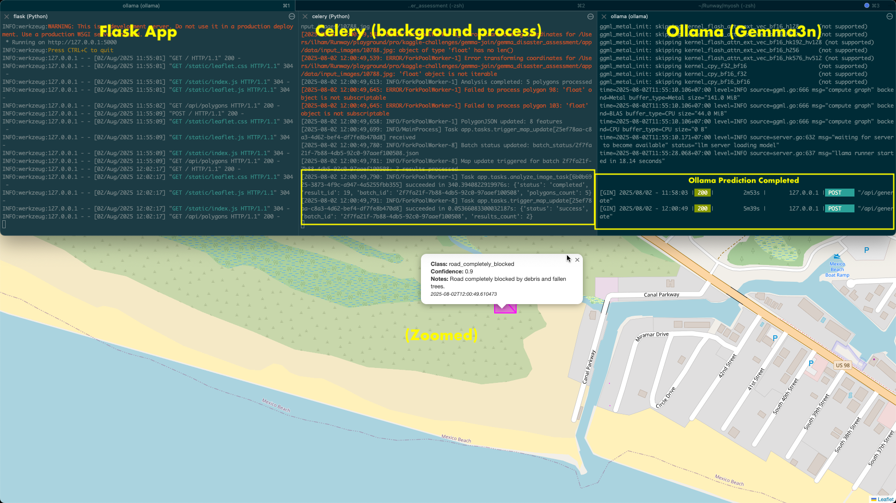

# Post Disaster Assessment
With Jetson Nano + Gemma + Ollama + Flask

## Executive Summary

This project demonstrates an AI-powered disaster assessment pipeline that leverages **Jetson Nano**, **Gemma LLM (via Ollama)**, and **Flask + Celery** for processing UAV imagery. By integrating real-time edge AI inference on the Jetson Nano with cloud-assisted task orchestration, we deliver **near real-time mapping** of disaster-affected regions, producing actionable **GeoJSON outputs** for emergency responders.

---

## High-Level Workflow Diagram


*From my unpublished paper, the area of research intersects with this project.

---

## Abstract

- **Objective**: Rapidly map building damages, road blockages, debris distribution, and flooding from aerial images for effective emergency response.
- **Technology Stack**:
  - **Jetson Nano**: Performs on-device pre-processing (image resizing, metadata extraction).
  - **Ollama (Gemma3n)**: Handles semantic segmentation and damage classification.
  - **Flask + Celery + Redis**: Orchestrates distributed processing and handles large batch analysis.
  - **SQLite**: Stores structured outputs for downstream mapping.
- **Result**: Produces **GeoJSON polygons** and metadata that can be directly visualized with **Leaflet.js** for field teams.

---

## Dataset Used

### 1. **RescueNet Dataset**
- **Description**: Post-disaster UAV imagery dataset featuring building damage, blocked roads, debris, and flooding scenarios.
- **Source**: [RescueNet Dataset](https://github.com/RescueNet/rescuenet-dataset) (open-source)
- **Content**:
  - RGB UAV images with disaster scene context
  - Annotated damage labels for buildings, debris, flooding, and roads
- **Usage in This Project**:
  - Used as the primary dataset for testing Gemma’s semantic analysis via Ollama.
  - Sample images are stored in `data/rescuenet/`.

### 2. **Synthetic Augmentation**
- Additional synthetic variations:
  - Artificial debris overlays and waterlogging.
  - Rotations and scaling to simulate various UAV camera angles.
- This improves the generalization of Gemma’s reasoning for unseen disaster scenarios.

---

## Technical Section

### Requirements

- Python 3.10+ (personal recommendation : user pyenv for python3.10 installation and python environment)
- Redis server running on `localhost:6379` # default
- Ollama running with `gemma3n` model installed
- SQLite (default: `sqlite:///site.db`)


### Getting Started

```bash
git clone https://github.com/your-username/gemma-disaster-assessment.git
cd gemma-disaster-assessment

python -m venv venv
source venv/bin/activate
pip install -r requirements.txt
```

### Database & Migrations.

```export FLASK_APP=manage.py
flask db init
flask db migrate -m "Initial tables for analysis results"
flask db upgrade
```

### Ollama Setup
```
# run this in terminal 1
ollama pull gemma3n:e4b
# it took a while in my case : 3-4 hours due poor connectivity
ollama serve
# Ensure Ollama server is running on http://localhost:11434
```

### Running Celery
```
# run this in terminal 2
celery -A app.extensions.celery worker --loglevel=info
```


### Running the app
```
# run this in terminal 3
flask run --debug
# Or for LAN access:
flask run --debug --host=0.0.0.0
```
local network IP might appeared to be access by mobile device

### Uploading & Processing

- Navigate to / and upload .jpg, .png, or .jpeg images.
- Images saved in data/input_images/.
- Each upload triggers a Celery task to call Ollama (Gemma3n).
- Results saved as polygons in DB, accessible as GeoJSON.

---
### Screenshots & Usage


#### Different terminals for each : Ollama, Celery (background task), Flask App

#### Result of predicted damage by Gemma3n

#### Result of predicted damage by Gemma3n - ZOOMED

#### Accessed by mobile device


#### DEMO Video (and a bit of background story)
[](https://youtu.be/qAUFMmxTvGI?si=-OnDikYp04kLUT45)

---


### Project Structure
```
app/
├── __init__.py
├── extensions.py
├── models.py
├── tasks.py
├── routes.py
├── core/
│   └── gemma_client.py
└── api/
    └── polygons.py
src/web/
├── templates/
│   └── index.html
└── static/
```

### Debugging
- Modify models.py for additional metadata or authentication.
- Use flask shell for DB inspection.
- Use Leaflet.js for rendering GeoJSON results.

### Reset DB (Dev Only)
```flask db downgrade base
rm -rf migrations
flask db init
flask db migrate -m "reset"
flask db upgrade
```

---

### Author
Ilham Akbar
Contact: [GitHub](https://github.com/ilhamije) | [LinkedIn](https://linkedin.com/in/ilhamije)

---

## Current Limitations and Roadmap

- **Lack of Fully Automatic Deployment (Without Docker)**:
  Currently, setting up this project manually (without Docker) requires multiple steps for Python environment, Redis, and Ollama.
  **Planned improvement**: Containerize the environment for **one-command deploy** and cross-platform reproducibility.

- **Model Fine-tuning on RescueNet**:
  The Gemma3n model used here is a general-purpose reasoning model. Although it performs well in disaster scene semantic mapping, it is **not yet fine-tuned** with RescueNet.
  **Planned improvement**: Fine-tune or adapter-train Gemma3n specifically on RescueNet to improve **damage classification accuracy and spatial prediction quality**.
